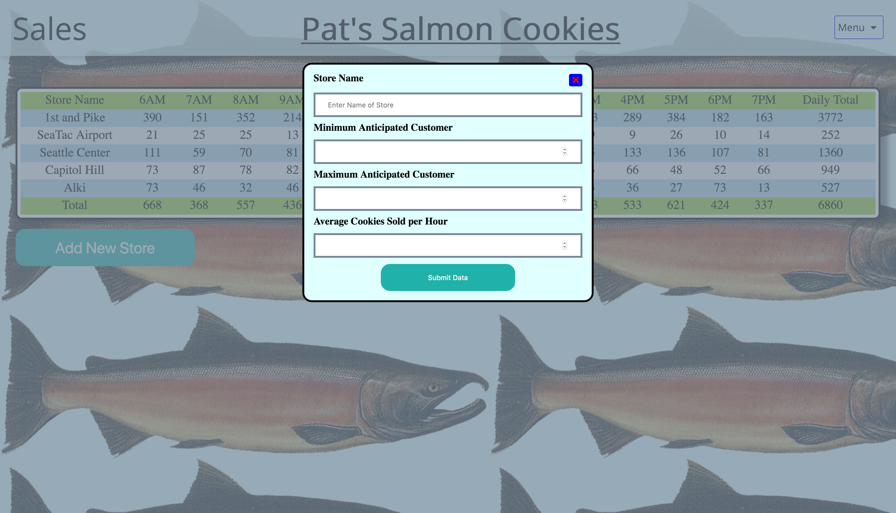

# [salmon-cookies](https://nguyenvinh2.github.io/salmon-cookies/sales.html)

    This Web Application is meant to demonstrate dynamic HTML data rendering using JavaScript on
    a static HTML web page.

## Explantion

    The problem domain is in the form of sales data randomly generated for 5 fictional stores.
    Each set of data is stored in its own JavaScript object and used to display on the web page
    via JS execution. 

## Author

    Vinh Nguyen

## Installation

    No installation is needed.

    You may clone this repo and utilize it to your liking.

    VSCODE is recommended for editing files.

## Version

    V0.5: 4/01/19 - Sales Data Generator for randomized values
    V0.6: 4/02/19 - Added in Constructor Functions
    V0.7: 4/03/19 - Added in Forms to create new stores
    V0.8: 4/04/19 - Added in other webpages
    V1.0: 4/05/19 - Completed site.

## Output

